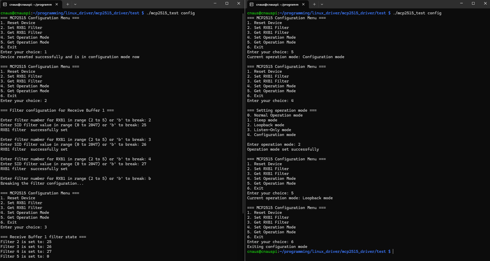
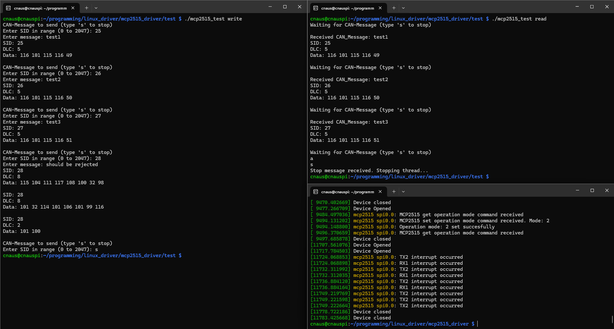
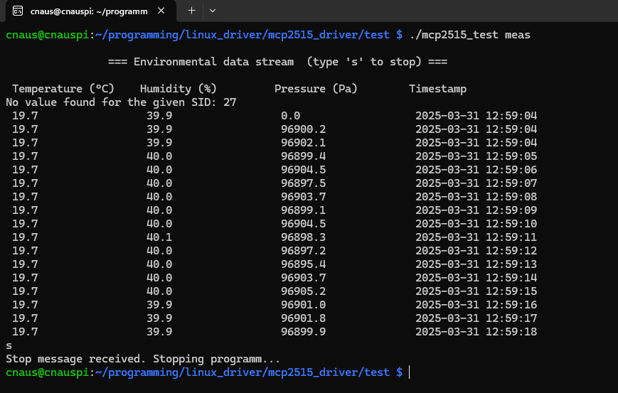

# MCP2515 Device Driver Configuration and Test Tool

This repository contains a command-line tool for configuring and testing the MCP2515 device driver on the Raspberry Pi 4. The test tool ensures that the MCP2515 CAN controller and device driver are working properly.

## Features
- **Configuration of MCP2515-Chip (via IOCTL-Interface)**:
  - Reset-Chip
  - Get/Set the Receive-Filter 2..5
  - Get/Set the Operation Mode
- **Data Transmission**: Write CAN-Message [SID:Data] on the CAN-Bus (or to the TX->RX-Buffer in loopback mode)
- **Data Reception**: Read CAN-Message [SID:Data] from the RX-Buffer
- **Environmental Data Measurement**: Reads the environmental data (temperature, humidity and air pressure) from the CAN bus and prints them in a table format

## Usage

### Configuration Mode
Run the tool in configuration mode to set up the MCP2515-Chip:

```sh
./mcp2515_test config
```



### Read/Write Mode
This model is well suited for testing in loopback mode. <br>
Run the tool in write or read mode to transmit or receive CAN-Messages:

```sh
./mcp2515_test write
```

```sh
./mcp2515_test read
```




### Environmental Data Measurement Mode
In this mode, the environmental measurement data is displayed in tabular form. This verifies the functionality of the entire system.

```sh
./mcp2515_test meas
```


## Installation

1. Clone the repository:

    ```sh
    git clone https://github.com/AndreasCnaus/PiCAN_Sense.git
    ```

2. Navigate to the test tool directory:

    ```sh
    cd PiCAN_Sense/test
    ```

3. Build the test tool:

    ```sh
    make
    ```

## License

This project is licensed under the MIT License. See the [LICENSE](LICENSE) file for details.
